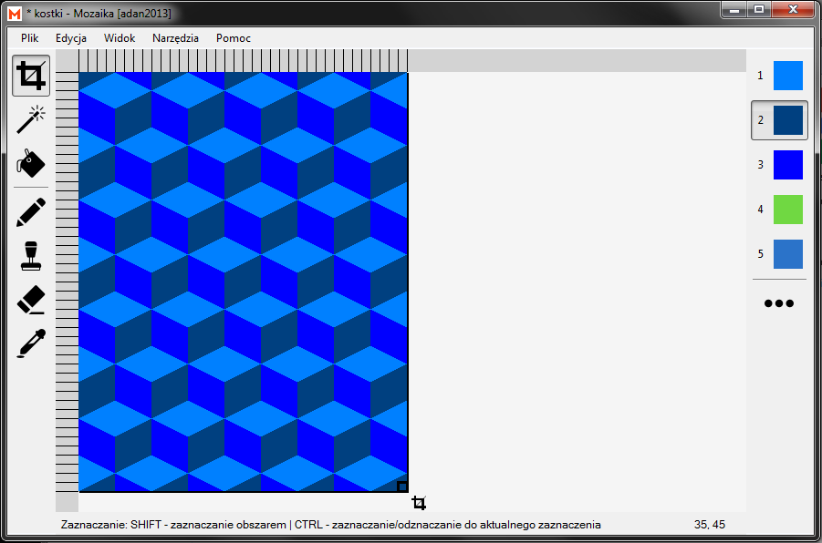
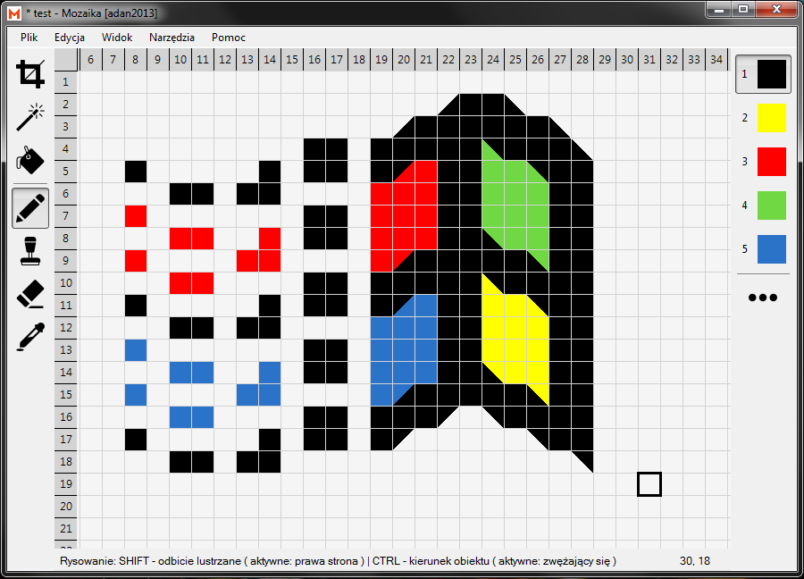
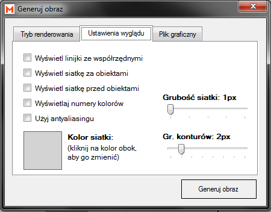
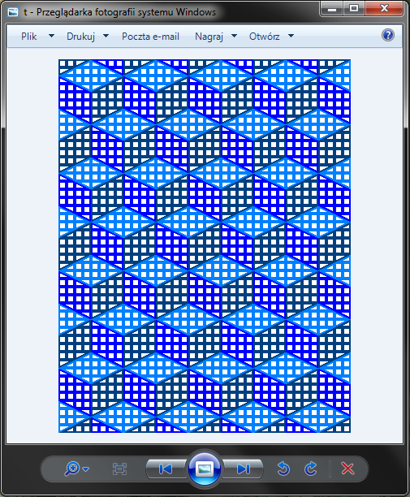
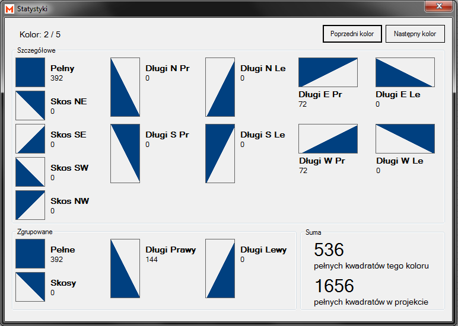

# Mozaika

## Opis
Aplikacja Mozaika jest prostym edytorem graficznym służącym do tworzenia prac typu pixel art. Została ona przystosowana do wygodnej pracy na pojedynczych pikselach oraz do generowania obrazów wyjściowych o różnych rozdzielczościach.

</img>

## Funkcje
Oto lista niektórych funkcji aplikacji Mozaika:
* tworzenie obrazów złożonych z kwadratów (pikseli)
* tworzenie obrazów z wykorzystaniem połówek kwadratów (po skosie)
* definiowanie własnej palety barw z możliwością zmiany koloru w całym projekcie
* łatwie tworzenie powtarzających się motywów dzięki narzędziom do duplikacji
* generowanie grafik rastrowych z obrazów utworzonych w aplikacji
* generowanie schematów konturowych z możliwością oznaczenia kolorów cyframi
* generowanie statystyk użycia poszczególnych figur w projekcie z podziałem na kolory
* narzędzia do pomocy w przygotowywaniu kolarzy z papieru czy innych materiałów

## Więcej informacji
Instrukcja obsługi aplikacji znajduje się w katalogu głównym udostępnionym na GitHubie. Zawiera ona dodatowe informacje o działaniu aplikacji i jej obsłudze.

[Otwórz instrukcje PDF](https://github.com/adan2013/Mozaika/blob/master/instrukcja.pdf)

## Instalacja i pierwsze uruchomienie
Aby móc uruchomić aplikację należy pobrać jej ostatnią wersję z zakładki "Releases" na GitHubie. Następnie rozpakować ją do folderu za pomocą np. aplikacji WinRAR lub domyślnego narzędzia wbudowanego w system operacyjny. W folderze znajdują się dwa pliki. Jeden to instrukcja obsługi w formacie PDF, a drugi to plik wykonywalny aplikacji. Program nie wymaga instalacji, ani wstępnej konfiguracji - jest gotowy do pracy zaraz po uruchomieniu.

[Otwórz stronę releases](https://github.com/adan2013/Mozaika/releases)

## Wygląd aplikacji
Ponieżej przedstawiam zrzuty ekranu prezentujące działanie aplikacji:

</img>

</img>

</img>

</img>